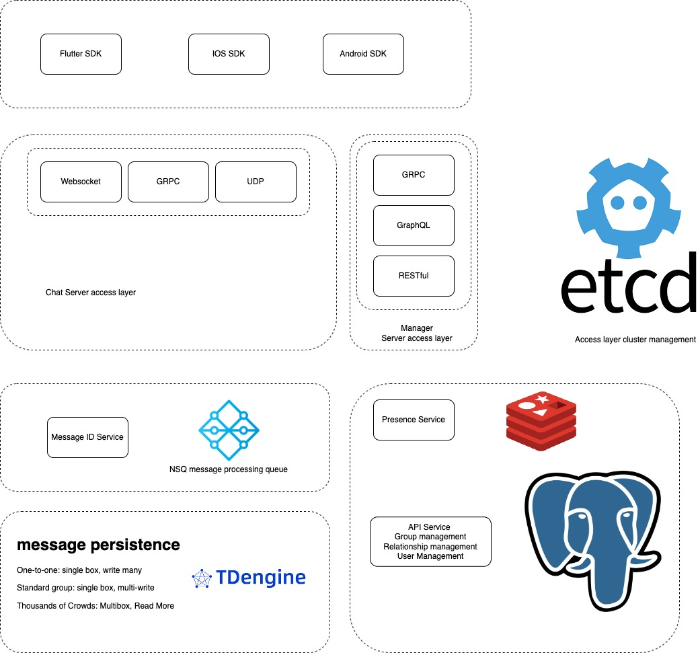

# ZIM

Zim, 开源即时通讯软件

## System Design

#### 系统分层

- 接入层
    - 聊天服务接入层
    - Websocket
    - GRPC
    - UDP
    - 管理端接入层
        - GRPC
        - GraphQL
        - RESTful
- 消息预处理
    - 消息ID生成器
    - NSQ 处理队列
- 用户在线状态
    - redis
- API服务
    - 用户关系
    - 群组关系
    - 登陆注册
    - pgsql
- im推送服务 Timeline
    - 一对一：单件箱，多写
    - 标准群：单件箱，多写
    - 千人群： 多件箱，多读

#### 消息流程

##### 发送单聊

msg -> gateway -> id generate -> mq -> 消息落地 -> 查询用户是否在线 

在线 -> 查在那个gateway 推送消息

不在线 -> 写离线表 -> 第三方消息推送

##### 发送群聊

msg -> gateway -> id generate -> mq -> 消息落地 -> 推送

#### 数据库设计

##### 表设计

> super_admin 最高角色表

- 表名称：super_admin
- 表描述：最高角色表
- 存储方式： Pgsql

| 行名称      | 行描述     | 行类型    |
|----------|---------|--------|
| SupID    | 超管id    | uuid   |
| SupToken | 超管token | String |

> project 项目表

- 表名称：project
- 表描述：im项目管理
- 存储方式：pgsql

| 行名称   | 行描述     | 行类型    |
|-------|---------|--------|
| ID    | 项目ID    | uuid   |
| SupID | 超管id    | uuid   |
| Name  | 项目名称    | String |
| Token | 项目token | String |

> 用户表

- 表名称： user
- 表描述： 用户表
- 存储方式： pgsql

| 行名称       | 行描述  | 行类型  |
|-----------|------|------|
| ID        | 用户id | uuid |
| ProjectID | 项目id | uuid |

> 群组表

- 表名称： group
- 表描述： 群组表
- 存储方式： pgsql

| 行名称       | 行描述  | 行类型  |
|-----------|------|------|
| ID        | 群组id | uuid |
| ProjectID | 项目id | uuid |

> 角色关系表

- 表名称： user_relationship
- 表描述： 用户关系表
- 存储方式： pgsql

| 行名称       | 行描述  | 行类型  |
|-----------|------|------|
| ProjectID | 项目id | uuid |
| UserID    | 用户id | uuid |
| FriendID  | 好友id | uuid |

> 群组角色关系表

- 表名称： group_relationship
- 表描述： 群组角色关系表
- 存储方式： pgsql

| 行名称       | 行描述  | 行类型  |
|-----------|------|------|
| ProjectID | 项目id | uuid |
| GroupID   | 群组id | uuid |
| UserID    | 用户id | uuid |

